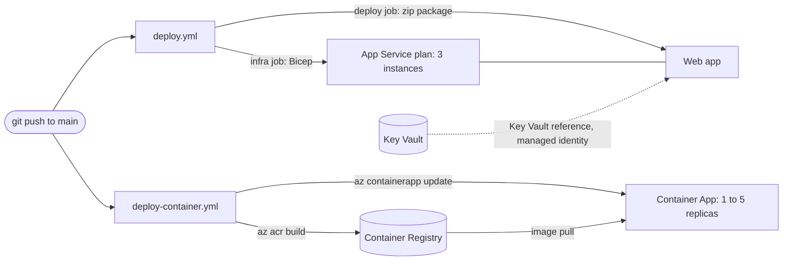

# Beacon on Azure: one app, two deployments

Beacon is a small ASP.NET Core API (plus a static page) that is deployed to Azure in two ways:

1. as a **web app on Azure App Service** (the *web track*), and
2. as a **container on Azure Container Apps** (the *container track*).

Both are created with Bicep, built and deployed by GitHub Actions, and designed to run more than one copy of the app. This document is the only documentation: it explains **what** was built, **why**, and **how to rebuild it from an empty repository and an empty Azure subscription**.

- **Part A** is the step-by-step guide. Follow it top to bottom.
- **Part B** explains the design: services, scaling, deployment strategy, security, alternatives and limits.
- **Part C** lists everything that actually went wrong while building this, as symptom, cause, fix.
- **Part D** checks the result against the assignment.

> The chronological lab log this document was rewritten from is still in git history: `git show 8364863:TUTORIAL.md`.

---

## 1. Overview

### What is deployed

| | Web track | Container track |
|---|---|---|
| Runs on | Azure App Service, Linux, plan B1, .NET 10 | Azure Container Apps (consumption), image from Azure Container Registry |
| Infrastructure as code | `infra/main.bicep` | `infra/container.bicep` |
| Pipeline | `.github/workflows/deploy.yml` | `.github/workflows/deploy-container.yml` |
| Scaling | 3 instances (manual scale-out), load balanced by the platform | 1 to 5 replicas, added automatically at 20 concurrent requests per replica |
| Health check | `healthCheckPath: /health` on the site, plus `scripts/health-check.sh` after each deploy | `scripts/health-check.sh` after each deploy |

The app has three endpoints: `GET /health` (returns `OK`), `GET /api/status`, and `GET /api/games/search?query=...` (searches Steam's public store endpoints, no API key). The function of the app is not the point; the infrastructure around it is.

### Architecture



Both workflows sign in to Azure with **OIDC**: GitHub issues a short-lived token for the run, Azure checks it against a federated credential on the pipeline identity, and no password or key is stored anywhere.

### Terms used in this document

| Term | Meaning |
|---|---|
| web track / container track | the App Service deployment / the Container Apps deployment |
| instance | one worker machine of the App Service plan (web track) |
| replica | one running copy of the container in Container Apps (container track) |
| registry | Azure Container Registry (ACR), where container images are stored |
| revision | an immutable version of a Container App, created whenever its template (for example the image) changes |
| pipeline identity | the Entra ID app registration `gh-clo25-<name>-we` that GitHub Actions signs in as |
| resource group | `rg-clo25-<name>-we`, the single container for every Azure resource below |
| teardown | deleting the resource group, which deletes everything inside it |

### Repository layout

| Path | What it is |
|---|---|
| `src/Beacon.Api/` | the application (`Program.cs`, `Steam/SteamClient.cs`, `wwwroot/`) and its `Dockerfile` |
| `tests/Beacon.Tests/` | xUnit tests (health endpoint, root page) |
| `infra/main.bicep` | web track: App Service plan and web app |
| `infra/container.bicep` | container track: registry, Container Apps environment, container app |
| `infra/security.bicep` | Key Vault with access policies and one secret |
| `infra/*.bicepparam` | the parameter file belonging to each template |
| `scripts/provision-all.sh` | builds the whole environment from nothing, in the order that works |
| `scripts/deploy-infra.sh`, `scripts/deploy-container.sh` | deploy one template each (both support `--what-if`) |
| `scripts/health-check.sh` | retries a URL until it answers `200` |
| `.github/workflows/` | the two pipelines |

### Time and cost

Setting everything up takes roughly 45 minutes the first time (the Container Apps environment is the slowest resource to create, 3 to 5 minutes). While everything is up it costs a few cents per hour, mostly the three B1 instances. Tear everything down when you are done (section A10).

---

# Part A. Step by step

Every command below is run from the repository root in **bash** (Git Bash on Windows, any terminal on Linux or macOS). Commands were run exactly like this to produce the outputs shown.

## A1. Prerequisites

| Tool | Tested with | Check |
|---|---|---|
| Azure CLI | 2.85 | `az version` |
| .NET SDK | 10.0 | `dotnet --version` |
| GitHub CLI | 2.97 | `gh --version` |
| bash and perl | Git Bash on Windows 11 (perl ships with it), Linux, macOS | `bash --version` |

Docker is **not** needed: images are built in Azure with `az acr build` (see B1 for why).

You need an Azure subscription where you are allowed to (1) create resource groups, (2) create role assignments on them (Owner or User Access Administrator), and (3) create app registrations in Entra ID. If you cannot do (2) or (3), skip A5 and run the deploy scripts yourself; the assignment accepts running privileged steps manually if the tutorial says so.

Sign in, and register the resource providers that a new subscription may not have used yet (harmless if they already are):

```bash
az login
az account show --query "{subscription:name, user:user.name}" -o table

gh auth login                       # needs the scopes repo and workflow
gh auth status

for ns in Microsoft.ContainerRegistry Microsoft.App Microsoft.KeyVault; do
  az provider register --namespace "$ns" --wait
done
```

**Windows only:** run `export MSYS_NO_PATHCONV=1` in every new terminal. Git Bash rewrites any argument that starts with a single `/` into a Windows path, which makes `az` fail with `MissingSubscription`. The scripts in this repository set it themselves; your own `az` commands do not.

## A2. Get the code and run it locally

Run the app before touching Azure. If something fails later, this tells you whether the app or the deployment is at fault.

```bash
git clone https://github.com/Xnenon02/beacon.git beacon
cd beacon

dotnet test --configuration Release     # expect: Passed!  Failed: 0, Passed: 2
dotnet run --project src/Beacon.Api     # listens on http://localhost:5001
```

In a second terminal:

```bash
curl http://localhost:5001/health       # "OK"
curl http://localhost:5001/api/status   # {"app":"Beacon","status":"running"}
curl "http://localhost:5001/api/games/search?query=dota"   # a JSON list of games
```

Open `http://localhost:5001/` for the search page. Stop the app with Ctrl+C.

## A3. Choose your names

Several Azure names must be globally unique, so everything is built from one short name of your own: 3 to 12 lowercase letters or digits, starting with a letter. The repository ships with the author's placeholder `namn`.

```bash
export NAME=alice                      # <- your own name here

export RG=rg-clo25-$NAME-we            # resource group
export PLAN=asp-clo25-$NAME-we         # App Service plan
export APP=app-clo25-$NAME-we          # web app (becomes <APP>.azurewebsites.net)
export ACR=acrclo25${NAME}we           # container registry: letters and digits only
export CAPP=ca-clo25-${NAME}we         # container app
export IDENT=gh-clo25-$NAME-we         # pipeline identity in Entra ID
export VAULT=kv-clo25-$NAME-we         # key vault (24 characters at most)

export LOCATION=westeurope             # the Azure region, see the note below
```

These variables only live in this terminal. **Run this block again in every new terminal.**

**The region.** `LOCATION` decides where the resource group is created, and every resource inherits the group's region. The `-we` in the names is only part of the name (it started as "West Europe"); it does not have to match the region. Whether a region accepts new B1 plans depends on your subscription and on the day: capacity runs out (C-1), quota can be zero (C-2), and a region can be closed to new resources for a subscription altogether (C-3). If provisioning in A6 fails for that reason, delete the empty group, export another region (for example `swedencentral`) and run A6 again.

Now replace the placeholder in the eight files that contain names, and check that none is left:

```bash
perl -pi -e "s/namn/$NAME/g" \
  infra/main.bicepparam infra/container.bicepparam infra/security.bicepparam \
  .github/workflows/deploy.yml .github/workflows/deploy-container.yml \
  scripts/deploy-infra.sh scripts/deploy-container.sh scripts/provision-all.sh

grep -rn namn infra .github scripts || echo "no placeholders left"
```

## A4. Create your own GitHub repository

Do this now, before the first push: the next step needs the repository to exist, and the first push will start both pipelines, which must not run before Azure is ready.

```bash
rm -rf .git                            # drop the author's history, start your own
git init -b main
gh repo create beacon --public --source=. --remote=origin
```

(`--public` lets anyone read it. A private repository works too if the person assessing it is added as a collaborator.) Nothing is pushed yet.

## A5. Create the pipeline identity (one time)

The pipelines need an identity in Azure. Instead of a password, it gets a **federated credential**: Azure will trust a token only if GitHub issued it for exactly this repository and the `main` branch.

First check whether it already exists (it survives teardown, so you only create it once):

```bash
az ad app list --display-name "$IDENT" --query "[].appId" -o tsv
```

If that printed an id, set `CLIENT_ID` to it and skip to the variables below. Otherwise:

```bash
# 1. The identity: an app registration plus its service principal
CLIENT_ID=$(az ad app create --display-name "$IDENT" --query appId -o tsv)
az ad sp create --id "$CLIENT_ID" -o none

# 2. Ask GitHub which "subject" it will put in the token. Do not type it by
#    hand: repositories created after July 2026 include numeric account and
#    repository ids in it, and the older form shown in most documentation
#    fails with AADSTS700213.
SUB_PREFIX=$(gh api repos/{owner}/{repo}/actions/oidc/customization/sub --jq .sub_claim_prefix)
echo "$SUB_PREFIX"                     # repo:<owner>@<id>/<repo>@<id>

# 3. The federated credential: only runs on the main branch of this repository
cat > credential.json <<EOF
{
  "name": "github-main",
  "issuer": "https://token.actions.githubusercontent.com",
  "subject": "${SUB_PREFIX}:ref:refs/heads/main",
  "audiences": ["api://AzureADTokenExchange"]
}
EOF
az ad app federated-credential create --id "$CLIENT_ID" --parameters credential.json -o none
rm credential.json
```

Give the workflows the three identifiers they need. These are **variables, not secrets**: they identify the identity but cannot be used to sign in.

```bash
gh variable set AZURE_CLIENT_ID       --body "$CLIENT_ID"
gh variable set AZURE_TENANT_ID       --body "$(az account show --query tenantId -o tsv)"
gh variable set AZURE_SUBSCRIPTION_ID --body "$(az account show --query id -o tsv)"
gh variable list
```

No role is granted yet, on purpose: a role is granted on a resource group, which does not exist yet. The deploy scripts grant it in the next step (explained in B4).

## A6. Provision the infrastructure

One command builds both tracks, in the order Azure requires:

```bash
./scripts/provision-all.sh "$RG" "$ACR"
```

| Step | What it does | Why this order |
|---|---|---|
| 1/4 | `deploy-infra.sh`: creates the resource group, deploys `infra/main.bicep` (App Service plan with 3 instances, web app), grants the pipeline identity `Contributor` on the group | everything else lives in the group |
| 2/4 | `az acr create`: the registry | an image cannot be pushed to a registry that does not exist |
| 3/4 | `az acr build`: builds the Dockerfile in Azure and pushes `beacon:v1` | a Container App that points at a missing image fails to deploy |
| 4/4 | `deploy-container.sh`: deploys `infra/container.bicep` (the registry again, now unchanged, plus the Container Apps environment and the container app) | needs the image from step 3 |

It takes 10 to 15 minutes and ends with `Both tracks are up.` Check what exists:

```bash
az resource list -g "$RG" --query "[].{Name:name, Type:type}" -o table
az role assignment list -g "$RG" --assignee "$CLIENT_ID" -o table    # Contributor, scope = the group
```

You should see the plan, the web app, the registry, the Container Apps environment and the container app, and one `Contributor` assignment for the pipeline identity. The web app is **empty** at this point (the infrastructure exists, the code does not); the pipeline deploys the code next.

## A7. Deploy the application with the pipelines

A new role assignment needs a minute or two to propagate. Wait, then push. The push starts both workflows:

```bash
sleep 120
git add -A
git commit -m "Beacon: app, infrastructure and pipelines"
git push -u origin main

gh run list --limit 4
gh run watch "$(gh run list --workflow deploy.yml --limit 1 --json databaseId -q '.[0].databaseId')"
gh run watch "$(gh run list --workflow deploy-container.yml --limit 1 --json databaseId -q '.[0].databaseId')"
```

What each pipeline does (the reasoning is in B3):

- **`deploy.yml`**: jobs `infra` and `build` run in parallel (`infra` re-applies `main.bicep`; `build` builds, tests and publishes). `deploy` waits for both, signs in, deploys the package to the web app, and runs `scripts/health-check.sh` against `/health`.
- **`deploy-container.yml`**: `build-and-push` runs the tests, then `az acr build` tags the image with the commit SHA. `deploy` rolls out a new revision with that tag and runs the health check against the Container App.

If a run fails with `No subscriptions found` or a health check that never answered, it is almost always a timing problem on a fresh environment (C-5, C-6): wait a minute and run `gh run rerun <run-id> --failed`.

To start a pipeline by hand (needed after every teardown, because a rebuilt web app is empty): `gh workflow run deploy.yml` and `gh workflow run deploy-container.yml`.

## A8. Verify both tracks

A green pipeline only proves the YAML ran. Ask Azure and the app directly. Never type a host name from memory; ask for it.

**Web track**

```bash
HOST=$(az webapp show -g "$RG" -n "$APP" --query defaultHostName -o tsv)
./scripts/health-check.sh "https://$HOST/health"          # OK: app responded 200
curl -s "https://$HOST/api/status"

az appservice plan list -g "$RG" --query "[].{Plan:name, Sku:sku.name, Instances:sku.capacity}" -o table
az webapp show -g "$RG" -n "$APP" \
  --query "{httpsOnly:httpsOnly, minTls:siteConfig.minTlsVersion, healthCheck:siteConfig.healthCheckPath, alwaysOn:siteConfig.alwaysOn}" -o json
```

Expect one plan, SKU `B1`, `3` instances; `httpsOnly: true`, TLS `1.3`, health check path `/health`.

**Container track**

```bash
FQDN=$(az containerapp show -g "$RG" -n "$CAPP" --query properties.configuration.ingress.fqdn -o tsv)
./scripts/health-check.sh "https://$FQDN/health"
curl -s "https://$FQDN/api/status"

az containerapp show -g "$RG" -n "$CAPP" --query properties.template.scale -o json
az containerapp replica list -g "$RG" -n "$CAPP" --query "[].name" -o tsv
az containerapp revision list -g "$RG" -n "$CAPP" --all \
  --query "[].{Revision:name, Active:properties.active, Traffic:properties.trafficWeight}" -o table
az containerapp show -g "$RG" -n "$CAPP" --query "properties.template.containers[0].image" -o tsv
```

Expect `minReplicas: 1`, `maxReplicas: 5` and an `http-scaling` rule with `concurrentRequests: 20`. The running image tag must equal the commit that was just pushed (`git rev-parse HEAD`): that is the proof that the pipeline deployed the new code, not only that it went green. The revision list shows the previous revision kept next to the new one that holds the traffic.

## A9. Secrets with Key Vault (security walkthrough)

This part shows how a secret reaches the web app without being stored in the repository, the pipeline, or the app configuration. It is not part of `provision-all.sh`; see B4 for why.

The web app already has a **system-assigned managed identity** (`identity: SystemAssigned` in `main.bicep`). `infra/security.bicep` creates a vault whose access policy lets that identity read secrets (`get`, `list`) and lets you write them. Your object id and the secret value are read from environment variables, so nothing personal or secret is committed:

```bash
export DEPLOYER_OBJECT_ID=$(az ad signed-in-user show --query id -o tsv)
printf 'Secret value (not echoed): '; read -rs SECRET_VALUE; echo; export SECRET_VALUE

az deployment group create \
  --name "security-$(date +%Y%m%d-%H%M%S)" \
  --resource-group "$RG" \
  --template-file infra/security.bicep \
  --parameters infra/security.bicepparam \
  --query properties.outputs -o json
```

Point an app setting at the secret. The setting holds a **reference**, not the value; App Service fetches the value from Key Vault with the app's identity when the app starts. The URI has no version, so it always resolves to the latest one:

```bash
az webapp config appsettings set -g "$RG" -n "$APP" \
  --settings "MY_SECRET=@Microsoft.KeyVault(SecretUri=https://$VAULT.vault.azure.net/secrets/demo-secret)" -o none
```

A setting that exists proves nothing: if the reference cannot be resolved the app silently receives the literal text `@Microsoft.KeyVault(...)`. Ask the platform whether it resolved:

```bash
APP_ID=$(az webapp show -g "$RG" -n "$APP" --query id -o tsv)
az rest --method get \
  --url "https://management.azure.com${APP_ID}/config/configreferences/appsettings?api-version=2022-03-01"
```

The entry for `MY_SECRET` should have status `Resolved`. Other statuses name the failure exactly (`SecretNotFound`, `AccessToKeyVaultDenied`, `VaultNotFound`).

## A10. Tear everything down, and bring it back

When you are done for the day, delete the resource group. Everything inside it goes with it:

```bash
az group delete --name "$RG" --yes --no-wait
az group show --name "$RG" --query properties.provisioningState -o tsv 2>/dev/null || echo "Gone"
```

`Deleting` means it is in progress and will finish without you. Use `provisioningState` rather than `az group exists`: a Container Apps environment can take ten minutes to empty and `exists` answers `true` the whole time.

**What survives** (it lives outside the group): the pipeline identity, its federated credential, the GitHub variables, the repository. **What is lost:** the role assignment (the next `provision-all.sh` grants it again), the registry and its images, the Key Vault and `MY_SECRET`. A deleted Key Vault keeps its name reserved for 7 days (soft delete), so use a new `VAULT` name if you want one sooner.

To bring it all back: run the name block from A3, then

```bash
./scripts/provision-all.sh "$RG" "$ACR"
sleep 120
gh workflow run deploy.yml
gh workflow run deploy-container.yml
```

`provision-all.sh` restores the infrastructure only; the web app stays empty until a pipeline deploys the code.

---

# Part B. Design and reasoning

## B1. Azure services, and why

| Service | Used for | Why this one |
|---|---|---|
| **App Service** (Linux, B1) | web track | A managed platform for web apps: no operating system to patch, a built-in load balancer across instances, a health check setting, deployment from a zip. B1 is the cheapest tier that can run more than one instance (the free and shared tiers cannot scale out), which is what the assignment requires. |
| **Container Apps** | container track | Runs containers without running a cluster. Gives revisions, HTTPS ingress with load balancing across replicas, and request-based autoscaling out of the box, which is exactly the scaling story the web track lacks on B1. |
| **Container Registry** (Basic) | image storage | The Container App needs a place to pull the image from. Basic is enough: one image, no geo-replication. |
| **Key Vault** | secrets | One place to keep a secret and control who may read it, so no secret has to be copied into app settings or pipelines. |
| **Entra ID** (app registration with federated credential) | pipeline identity | Lets GitHub Actions deploy without a stored password (B4). |
| **Bicep** | infrastructure as code | Azure's own declarative language: no extra tool or state file to manage, and `what-if` shows the change before anything happens. |
| **GitHub Actions** | CI/CD | The code already lives on GitHub, it is free for public repositories, and it is what the runner image and scripts here are written for. |

**Why images are built with `az acr build` and not `docker build`.** Docker Desktop could not run on the author's machine: it is school-managed and virtualization is locked at policy level ("Virtualization support not detected, contact your IT admin"). `az acr build` sends the build context to Azure and builds there, so no local Docker is needed. It takes the same `--file` and build-context arguments as `docker build`. It also simplifies the pipeline: the runner needs no registry password, only the OIDC login it already has. The cost is that there is no local `docker run` smoke test; the first real test of an image is the deployed Container App.

## B2. Scaling and load balancing, in both tracks

**Web track: fixed capacity, platform load balancing.** The plan runs `3` instances (`instanceCount` in `infra/main.bicepparam`, the maximum B1 allows, set by `sku.capacity` in the template). App Service's front end spreads requests across the instances. This is **manual scale-out**: B1 supports setting the number of instances by hand (`az appservice plan update --number-of-workers`, or changing the parameter and redeploying), but rule-based autoscale needs the Standard tier or higher. Setting the count in the template means it is a decision recorded in Git instead of something someone once typed in a terminal. One detail to know: sites created this way have **ARR affinity** switched on by default (a cookie that pins a client to one instance), so load is spread per client rather than per request; for a stateless API it could be switched off.

**Container track: a range and a rule.** The container app runs between `minReplicas: 1` and `maxReplicas: 5`, with an `http-scaling` rule of `concurrentRequests: 20`: when the average number of concurrent requests per replica passes 20, Container Apps starts another replica, up to five, and removes them again when the load drops. Ingress distributes requests across the running replicas. The minimum of 1 avoids cold starts (setting it to 0 would scale to zero and cost nothing when idle, at the price of a delay on the first request). The numbers are reasonable starting values for a small stateless API; they were **not load-tested**, so treat them as a starting point, not a measurement. Under a real traffic spike this is the track that reacts on its own; the web track would need a manual `--number-of-workers` change or a move to Standard.

**State: each instance and replica has its own memory.** `SteamClient` caches Steam responses in `IMemoryCache` (search results 5 minutes, app details 6 hours, player counts 60 seconds). That cache exists *per instance or replica*: with 3 instances and up to 5 replicas there are up to 8 independent caches that do not know about each other. Effects: more calls to Steam than a shared cache would make, and two requests can briefly show different player counts. That is acceptable here because the cached data is read-only and non-critical (a stale player count is a freshness trade-off, not a wrong result). The same problem would be a real bug for anything the app *writes*: a counter or a file on disk would also exist once per instance. Shared state would have to move to an external store such as a database or a shared cache, which is out of scope for this assignment.

## B3. Deployment strategy

**Web track: in-place deployment to a single production site, with a health gate.** `azure/webapps-deploy` uploads the build output as a package and App Service restarts the site on it. The pipeline order is: `infra` and `build` in parallel (neither depends on the other), `deploy` only after both succeed (`needs: [build, infra]`, so code is never deployed to a plan that does not exist yet), then `scripts/health-check.sh` retries `/health` for about 45 seconds and fails the run if the app never answers `200`. Blue-green with a slot swap is the usual alternative, but **deployment slots need the Standard tier**, which B1 is not. The health check on the site additionally makes App Service take an instance that keeps failing `/health` out of the load-balancer rotation.

**Container track: a new immutable revision per commit.** Each push builds one image tagged with the commit SHA (and `latest`), then `az containerapp update --image <registry>/beacon:<sha>` creates a new revision. Container Apps runs in *single-revision mode* (the default): traffic moves to the new revision once it is ready and the previous revision is kept, deactivated, next to it. That is a rolling replacement without downtime, and a rollback is another `az containerapp update` with an older SHA. The **commit SHA as tag is the most important line of the workflow**: Container Apps only creates a revision when the template changes, so pushing a new image to the same `:latest` tag would change nothing and the pipeline would go green while the app kept running old code.

**Why the pipelines own different things.** The web pipeline re-applies its Bicep template on every push (`infra` job): the template does not depend on the code, so re-applying is idempotent and keeps drift out. The container pipeline does **not** run `container.bicep`, because that template pins `containerImage` to `:v1`; running it on every push would roll the app back to `v1` each time. So the image is owned by the pipeline (`az containerapp update`), and the template is only run by a person through `deploy-container.sh` when the *infrastructure* changes (scaling, port, size). Running that script after a deployment does roll the app back to `v1` until the next push. Two things deciding which image runs is a known weakness (B6).

**The limit of the health check.** After a Container App rollout the check proves that *an* instance answers `200`, not that the *new revision* does: if the new revision failed to start, Container Apps keeps routing to the old one and the check still passes. The only way to see that is `az containerapp revision list`, which is why A8 compares the running image tag to the commit.

## B4. Security design

| Concern | What was done | Why |
|---|---|---|
| **Pipeline authentication** | OIDC with a federated credential on `gh-clo25-<name>-we`. Nothing secret is stored in GitHub; only three identifiers (client, tenant, subscription id) are kept as repository *variables*. | A stored password works anywhere, for anyone who obtains it, until someone rotates it. A federated token is issued per run, lives for minutes, and Azure only accepts it for the exact subject `repo:<owner>/<repo>:ref:refs/heads/main`: this repository, this branch, nothing else. A pull request or another branch cannot sign in. |
| **Least privilege** | The identity has `Contributor` on **one resource group**, not on the subscription. The workflows request only `id-token: write` and `contents: read`. | If the pipeline were compromised it could change this one group, not the subscription. The price: a role assignment belongs to its scope and **is deleted with the resource group**, so after every teardown it must be granted again. The scripts do that (the block at the end of `deploy-infra.sh`). The pipeline cannot re-grant it for itself, which is correct: an identity that could assign its own roles would defeat the purpose. |
| **Application secrets** | The web app has a system-assigned managed identity; Key Vault grants that identity `get` and `list` only. The app setting holds a Key Vault *reference*. The secret value was passed in through an environment variable (`@secure()` in the template, `readEnvironmentVariable` in the parameter file), so it is not in Git and shows as `*******` in `what-if` and deployment history. | The app proves who it is with its identity; no password exists to leak. Read-only for the app means a compromised app cannot overwrite secrets. |
| **Key Vault permission model** | Access policies (`enableRbacAuthorization: false`), a deliberate trade-off. | RBAC is the recommended model, but it needs a role assignment per identity, and role assignments die with the resource group (the same problem as above). Access policies live inside the vault resource and work with plain `Contributor`. Less granular and older, but it works with the rights this subscription grants. With the right to assign roles, RBAC would be the better choice. |
| **Registry access** | The registry has its **admin user enabled**; the Container App pulls the image with that username and password, stored as a Container App secret and read at deploy time with `acr.listCredentials()` (never typed, never in Git). | A conscious trade-off: it is the simplest working setup, but it is one shared credential that can push, pull and delete for the whole registry. The better design (a managed identity with the `AcrPull` role, no password at all) was **built and verified** and then **reverted**: its role assignment sits on the registry inside the resource group, so after a teardown the rebuilt app would have no right to pull its image and the container track would not start. With the right to assign roles from the provisioning script, this is the first thing to change. |
| **Transport** | `httpsOnly: true` and a TLS floor of 1.3 on the web app; `allowInsecure: false` on the Container App ingress (HTTP is redirected to HTTPS). | Nothing is served unencrypted. TLS 1.3 is a real restriction: a client that only speaks TLS 1.2 is refused. |
| **Network** | No restrictions: both apps are public on purpose (they are public APIs), and the vault and registry are reachable over the internet but require authentication. | The assignment asks for identity *or* network limits, and identity was the focus. Next step: Key Vault firewall or private endpoint, and private link for the registry (needs the Premium tier). |
| **Repository hygiene** | Nothing personal or secret is committed: identifiers are GitHub variables, the deployer's object id and the secret value are read from environment variables, and `publish-profile.xml`-style files are git-ignored. | The repository is public. |

**A secret that is not rebuilt, on purpose.** `provision-all.sh` does not deploy the Key Vault, and `MY_SECRET` is set with a CLI command, not in Bicep. A vault that is deleted keeps its name for 7 days (soft delete cannot be turned off), so a rebuild script that creates it would fail on the second run. And `appSettings` in a template **replaces all** settings of the app, so a template that owns one setting must own every setting, otherwise everything set by hand disappears at the next deploy. The consequence: after a rebuild, the app answers `200`, the pipeline is green, and `MY_SECRET` is silently gone. It is a conscious deviation from "everything as code"; the next step is to move all app settings and the vault into the templates.

## B5. Alternatives considered

| Decision | Chosen | Considered, and why not |
|---|---|---|
| Web hosting | App Service | **Virtual machines**: full control but patching, scaling and load balancing become my job. **Static Web Apps / Functions**: do not fit a general web API with the same app for both tracks. |
| Container hosting | Container Apps | **AKS**: powerful, but a cluster to operate is far more than a small stateless API needs. **Container Instances**: runs a container but has no revisions, autoscaling or managed ingress. **App Service for Containers**: would reuse the same plan model as the web track and show nothing new about container-native scaling. |
| Infrastructure as code | Bicep | **Terraform**: cloud-neutral and widely used, but adds a tool, a provider and a state file to protect, for a project that only targets Azure. **ARM JSON**: the same engine, far harder to read. **Imperative `az` scripts**: cannot describe the desired state or preview a change; they drift. |
| CI/CD | GitHub Actions | **Azure DevOps Pipelines**: a second service and sign-in for code that already lives on GitHub. |
| Pipeline login | OIDC federated credential | **Publish profile** (used first): a key tied to one app instance, dead after every rebuild, and it can only upload code, not create resources. **Service principal secret** (`AZURE_CREDENTIALS`, used next): works, but it is a stored password. Both were used and replaced; the secret was kept as a fallback until OIDC had been shown to work after a teardown and rebuild, then removed. |
| Image build | `az acr build` | **Local `docker build`**: not possible on this machine. **`docker build` and `docker push` on the runner**: works, but needs the registry password as a pipeline secret. |
| Deployment strategy | In-place on the web track, revisions on the container track | **Slot swap (blue-green)**: needs Standard. **Canary / traffic split**: Container Apps supports it with multiple active revisions; more configuration than a small API with a health gate needs. |
| Secret store | Key Vault with managed identity | **GitHub or app settings holding the value**: the secret would be copied into places that cannot be audited or rotated centrally. |
| Vault permissions | Access policies | **RBAC**: preferred in general, blocked here by the need to assign roles per identity (B4). |
| Registry credentials | Admin user | **Managed identity with `AcrPull`**: better, built, reverted (B4). |

## B6. Known limitations and next steps

- **No load test.** Scaling is configured and verified as configuration; the 20 concurrent requests per replica and the replica range are starting values, not measured limits.
- **The web track cannot autoscale** on B1. Next step: Standard tier with an autoscale rule, which also unlocks deployment slots.
- **ARR affinity is on** for the web app; for a stateless API it could be disabled (`clientAffinityEnabled: false`) for evenly spread load.
- **No explicit probes on the container.** The Container App relies on the platform's defaults; `/health` is only used by the pipeline's check. Next step: HTTP liveness and readiness probes on `/health`, so a new replica only receives traffic when it is healthy.
- **No monitoring.** No Log Analytics workspace, alerts or dashboards are configured.
- **Two things decide which image runs** (the template's `:v1` and the pipeline's commit SHA); running `deploy-container.sh` after a deployment rolls the app back to `v1`. Next step: have the template read the current image instead of pinning one.
- **The registry is defined twice**: created with `az acr create` in `provision-all.sh` (it must exist before the first image) and declared in `container.bicep`, which then finds it unchanged. It works, but it is duplication.
- **Registry admin user and public network access** (B4), and **Key Vault, `MY_SECRET` and the `AcrPull` role are not part of the rebuild** (B4).
- **A fresh role assignment takes a minute or two to work**, and nothing in the scripts waits for it (C-5).
- **Regions come and go per subscription.** West Europe worked on one day and was closed to new resources a week later; the scripts take the region from `LOCATION`, but nothing checks in advance that a region will accept the deployment (C-3).
- **Tests are minimal**: two tests (health endpoint, root page). The pipeline gate exists; coverage of the API is thin.

---

# Part C. Troubleshooting

Each of these happened while building this. Symptom, cause, fix.

| # | Symptom | Cause | Fix |
|---|---|---|---|
| C-1 | `No available instances to satisfy this request` when creating the plan | Transient capacity shortage for B1 in that region | Retry a few minutes later. Not the same as the next row. |
| C-2 | `Operation cannot be completed without additional quota. Current Limit (B1 VMs): 0` | The subscription has no B1 quota in that region (not transient) | Use another region (`LOCATION=... ./scripts/provision-all.sh ...`) or request quota. |
| C-3 | `RequestDisallowedByAzure ... The selected region is currently not accepting new customers` | The region is closed to new resources for this subscription (worked earlier, stopped working). The resource group is created but stays empty. `az appservice list-locations` still lists the region, so it cannot warn you. | Delete the empty group (`az group delete -n "$RG" --yes`), `export LOCATION=swedencentral` (or another region), run A6 again. A resource group's region cannot be changed, which is why it must be recreated. |
| C-4 | `MissingSubscription`, or a path like `C:/Program Files/Git/subscriptions/...` in an error | Git Bash on Windows rewrote an argument starting with `/` | `export MSYS_NO_PATHCONV=1` (the scripts do it themselves). Hit four times in four different places: any `az` argument starting with a single `/` is suspect. |
| C-5 | Pipeline login fails with `No subscriptions found` right after provisioning | The role assignment was just created and has not propagated, or it is missing | Check `az role assignment list -g "$RG" --assignee "$CLIENT_ID" -o table`; if it is there, wait two minutes and `gh run rerun <id> --failed`. |
| C-6 | `deploy` fails with `FAILED: app never responded 200 after 10 attempts`, or ten `404`s | Cold start or restart of a freshly created or reconfigured app takes longer than the check's 45 seconds | `curl` the URL a minute later; if it answers `200`, re-run the failed job. |
| C-7 | Login is green but the next step fails with `AuthorizationFailed` | The identity has no role on the (new) resource group, or `SP_NAME` in the scripts does not match your `IDENT` | `grep -n 'SP_NAME=' scripts/*.sh` must show your identity name; run `./scripts/deploy-infra.sh "$RG"` again, which grants the role. |
| C-8 | `AADSTS700213` or "no matching federated identity record" on login | The subject in the federated credential does not match what GitHub sends | Recreate the credential with the subject from `gh api repos/{owner}/{repo}/actions/oidc/customization/sub` (A5). The run log prints the exact `subject claim` it sent. |
| C-9 | `MissingSubscriptionRegistration` | A resource provider was never used in this subscription | `az provider register --namespace Microsoft.App --wait` (also `Microsoft.ContainerRegistry`, `Microsoft.KeyVault`). |
| C-10 | `Website with given name ... already exists`, or the registry name is rejected | Names are globally unique; registry names allow only lowercase letters and digits | Pick another `NAME` and redo A3. `az acr check-name --name <name> -o table` checks a registry name. |
| C-11 | Container App deployment fails with `ImagePullFailure` or `manifest unknown` | The image or tag does not exist in the registry yet | `az acr repository show-tags --name "$ACR" --repository beacon -o table`. Order is registry, image, app. |
| C-12 | `RequestDisallowedByPolicy` on the registry | The subscription forbids `adminUserEnabled: true` | Set it to `false`; then the Container App needs the managed-identity route from B4. |
| C-13 | `BCP427` when deploying `security.bicep` | `DEPLOYER_OBJECT_ID` or `SECRET_VALUE` is not set in this terminal | Export both (A9). |
| C-14 | Key Vault name rejected after a teardown | A deleted vault keeps its name for 7 days | Use a new `VAULT` name. |
| C-15 | `az` shows `null` for the plan id of a web app | An older Azure CLI names the field `appServicePlanId` instead of `serverFarmId` | `az upgrade`, or use the old field name. |
| C-16 | A teardown or provisioning log shows success, but steps are missing | `script ... \| tee log` reports the exit code of `tee`, not of the script | Look for the script's last line (`Both tracks are up.`) instead of the exit code. |
| C-17 | `git push` is rejected for `.github/workflows/...` | The `gh` token lacks the `workflow` scope | `gh auth refresh -h github.com -s workflow`, then `gh auth setup-git`. |
| C-18 | `az acr build` fails with `ParentResourceNotFound ... listBuildSourceUploadUrl` right after the registry was created | The build service does not see a registry that is only seconds old (eventual consistency). The registry does exist. | Run the command again after a few seconds. `provision-all.sh` retries by itself, up to five times. |
| C-19 | Docker commands fail with `docker: command not found` or "Virtualization support not detected" | Docker Desktop cannot run on this machine | Use `az acr build` (B1); there is no local `docker run`. |
| C-20 | `az deployment group create` ends with `DeploymentNotFound: Deployment ... could not be found` | The CLI asked for the status of a deployment that Azure Resource Manager had not registered yet (eventual consistency). The deployment itself usually succeeds. | `az deployment group list -g "$RG" -o table` shows the real state. Every script is idempotent, so simply run the same command again. |

---

# Part D. Checklist against the assignment

| Requirement | Where it is |
|---|---|
| Same app deployed to App Service and to Container Apps | Overview; A6, A7 |
| Infrastructure as code for both | `infra/main.bicep`, `infra/container.bicep` (`infra/security.bicep` for the vault) |
| Built and deployed by GitHub Actions, both tracks | `.github/workflows/deploy.yml`, `.github/workflows/deploy-container.yml`; A7 |
| Designed for scale (instances, replicas, rules) | 3 instances; 1 to 5 replicas with an HTTP rule; B2 |
| A `Dockerfile` | `src/Beacon.Api/Dockerfile` |
| At least one own shell script beyond the workflows | `scripts/provision-all.sh`, `deploy-infra.sh`, `deploy-container.sh`, `health-check.sh` |
| One documentation file | this file |
| Which services and why | B1 |
| Scaling and load balancing in both tracks | B2 |
| Deployment strategy and why it fits | B3 |
| Step by step from an empty repository and resource group | Part A |
| Security design (secrets, identities, restrictions, why) | B4, A9 |
| Alternatives considered | B5 |
| State kept per instance or replica | B2 |
| Honest limits and next steps | B6 |

## Verification status

_(filled in after the end-to-end run, see below)_
