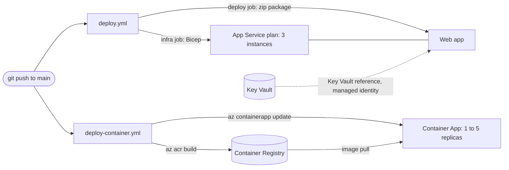

# Beacon on Azure: one app, two deployments

Beacon is a small ASP.NET Core API (plus a static page) that is deployed to Azure in two ways:

1. as a **web app on Azure App Service** (the *web track*), and
2. as a **container on Azure Container Apps** (the *container track*).

Both are created with Bicep, built and deployed by GitHub Actions, and designed to run more than one copy of the app.

This document is the only documentation. It explains **what** was built, **why**, and **how to rebuild it from an empty repository and an empty Azure subscription**.

- **Part A** is the step-by-step guide for when everything goes as expected. Follow it top to bottom.
- **Part B** explains the design: the key decisions, services, scaling, deployment strategy, security, alternatives, limits, and the terms used.
- **Part C** is troubleshooting, grouped by category. Part A points to it when something can go wrong.
- **Part D** checks the result against the assignment and the learning goals.

> Last tested end to end on 2026-10-05; see "Verification status" at the end. The chronological lab log this document was rewritten from is still in git history: `git show 8364863:TUTORIAL.md`.

---

## 1. Overview

### What is deployed

| | Web track | Container track |
|---|---|---|
| Runs on | Azure App Service, Linux, plan B1, .NET 10 | Azure Container Apps (consumption), image from Azure Container Registry |
| Infrastructure as code | `infra/main.bicep` | `infra/container.bicep` |
| Pipeline | `.github/workflows/deploy.yml` | `.github/workflows/deploy-container.yml` |
| Scaling | 3 instances (manual scale-out), load balanced by the platform | 1 to 5 replicas, added automatically at 20 concurrent requests per replica |
| Health check | `healthCheckPath: /health` on the site, plus `scripts/health-check.sh` after each deploy | `scripts/health-check.sh` after each deploy |

The app has three endpoints: `GET /health` (returns `OK`), `GET /api/status`, and `GET /api/games/search?query=...` (searches Steam's public store endpoints, no API key). The function of the app is not the point; the infrastructure around it is.

Two words to know before you start: a copy of the app is an **instance** on the web track and a **replica** on the container track. The full list of terms is in B7.

### Architecture



Both workflows sign in to Azure with **OIDC**: no password or key is stored anywhere (B4).

### Repository layout

| Path | What it is |
|---|---|
| `src/Beacon.Api/` | the application (`Program.cs`, `Steam/SteamClient.cs`, `wwwroot/`) and its `Dockerfile` |
| `tests/Beacon.Tests/` | xUnit tests (health endpoint, root page) |
| `infra/main.bicep` | web track: App Service plan and web app |
| `infra/container.bicep` | container track: registry, Container Apps environment, Container App |
| `infra/security.bicep` | Key Vault with access policies and one secret |
| `infra/*.bicepparam` | the parameter file belonging to each template |
| `scripts/provision-all.sh` | builds the whole environment from nothing, in the order that works |
| `scripts/deploy-infra.sh`, `scripts/deploy-container.sh` | deploy one template each (both support `--what-if`) |
| `scripts/health-check.sh` | retries a URL until it answers `200` |
| `.github/workflows/` | the two pipelines |

### Time and cost

- **Time:** roughly 45 minutes the first time. The Container Apps environment is the slowest resource to create.
- **Cost:** a few cents per hour while everything is up, mostly the three B1 instances. More instances running for longer cost more.
- **When you are done:** tear everything down (A10).

---

# Part A. Step by step

Run every command from the repository root in **bash**: Git Bash on Windows, any terminal on Linux or macOS. If something goes wrong, the step names the entry in Part C to look at.

## A1. Prerequisites

| Tool | Tested with | Check |
|---|---|---|
| Azure CLI | 2.85 | `az version` |
| .NET SDK | 10.0 | `dotnet --version` |
| GitHub CLI | 2.97 | `gh --version` |
| bash and perl | Git Bash on Windows 11 (perl ships with it), Linux, macOS | `bash --version` |

Docker is **not** needed: images are built in Azure with `az acr build` (reason in B1).

You need an Azure subscription where you may:

1. create resource groups,
2. create role assignments on them (Owner or User Access Administrator), and
3. create app registrations in Entra ID.

If you cannot do 2 or 3, skip A5 and run the deploy scripts yourself. The assignment accepts running privileged steps manually if the tutorial says so.

Sign in, and register the resource providers a new subscription may not have used yet (harmless if they already are):

```bash
az login
az account show --query "{subscription:name, user:user.name}" -o table

gh auth login                       # needs the scopes repo and workflow
gh auth status

for ns in Microsoft.ContainerRegistry Microsoft.App Microsoft.KeyVault; do
  az provider register --namespace "$ns" --wait
done
```

On Windows, work in Git Bash. If `az` complains about a path, see C-4.

## A2. Get the code and run it locally

Run the app before touching Azure. If something fails later, this tells you whether the app or the deployment is at fault.

```bash
git clone https://github.com/Xnenon02/beacon.git beacon
cd beacon

dotnet test --configuration Release     # expect: Passed!  Failed: 0, Passed: 2
dotnet run --project src/Beacon.Api     # listens on http://localhost:5001
```

In a second terminal:

```bash
curl http://localhost:5001/health       # "OK"
curl http://localhost:5001/api/status   # {"app":"Beacon","status":"running"}
curl "http://localhost:5001/api/games/search?query=dota"   # a JSON list of games
```

Open `http://localhost:5001/` for the search page. Stop the app with Ctrl+C.

## A3. Choose your names

Several Azure names must be globally unique, so everything is built from one short name of your own: 3 to 12 lowercase letters or digits, starting with a letter. The repository ships with the author's placeholder `namn`.

```bash
export NAME=alice                      # <- your own name here

export RG=rg-clo25-$NAME-we            # resource group
export PLAN=asp-clo25-$NAME-we         # App Service plan
export APP=app-clo25-$NAME-we          # web app (becomes <APP>.azurewebsites.net)
export ACR=acrclo25${NAME}we           # container registry: letters and digits only
export CAPP=ca-clo25-${NAME}we         # Container App
export IDENT=gh-clo25-$NAME-we         # pipeline identity in Entra ID
export VAULT=kv-clo25-$NAME-we         # key vault (24 characters at most)

export LOCATION=westeurope             # the Azure region
```

These variables only live in this terminal. **Run this block again in every new terminal.**

`LOCATION` is where the resource group, and everything in it, is created. The `-we` in the names is only text and does not have to match the region. If a region is full or closed for your subscription, use another one such as `swedencentral` (C-1 to C-3).

Now replace the placeholder in the eight files that contain names, and check that none is left:

```bash
perl -pi -e "s/namn/$NAME/g" \
  infra/main.bicepparam infra/container.bicepparam infra/security.bicepparam \
  .github/workflows/deploy.yml .github/workflows/deploy-container.yml \
  scripts/deploy-infra.sh scripts/deploy-container.sh scripts/provision-all.sh

grep -rn namn infra .github scripts || echo "no placeholders left"
```

## A4. Create your own GitHub repository

Do this now, before the first push. The next step needs the repository to exist, and the first push starts both pipelines, which must not run before Azure is ready.

```bash
rm -rf .git                            # drop the author's history, start your own
git init -b main
gh repo create beacon --public --source=. --remote=origin
```

`--public` lets anyone read it; a private repository works too if the person assessing it is added as a collaborator. Nothing is pushed yet.

## A5. Create the pipeline identity (one time)

The pipelines need an identity in Azure. Instead of a password it gets a **federated credential**: Azure trusts a token only if GitHub issued it for exactly this repository and the `main` branch.

> **If you are new to Azure, three words before the commands:**
>
> - **App registration**: the identity itself, a named entry in Entra ID (Azure's user directory) that stands for "the GitHub pipeline".
> - **Service principal**: the copy of that identity inside your subscription. This is the thing that can be given a role (permission) later.
> - **Federated credential**: the rule that says "trust a login token issued by GitHub for this repository and branch". It replaces a password, so there is nothing to store or leak.
>
> The commands below create these three, in that order.

The identity lives in Entra ID and survives teardown, so you only create it once. First check whether it already exists:

```bash
az ad app list --display-name "$IDENT" --query "[].appId" -o tsv
```

If that printed an id, set `CLIENT_ID` to it and skip to the variables below. Otherwise:

```bash
# 1. The identity: an app registration plus its service principal
CLIENT_ID=$(az ad app create --display-name "$IDENT" --query appId -o tsv)
az ad sp create --id "$CLIENT_ID" -o none

# 2. Ask GitHub which "subject" it will put in the token. Do not type it by hand.
SUB_PREFIX=$(gh api repos/{owner}/{repo}/actions/oidc/customization/sub --jq .sub_claim_prefix)
echo "$SUB_PREFIX"                     # repo:<owner>@<id>/<repo>@<id>

# 3. The federated credential: only runs on the main branch of this repository
cat > credential.json <<EOF
{
  "name": "github-main",
  "issuer": "https://token.actions.githubusercontent.com",
  "subject": "${SUB_PREFIX}:ref:refs/heads/main",
  "audiences": ["api://AzureADTokenExchange"]
}
EOF
az ad app federated-credential create --id "$CLIENT_ID" --parameters credential.json -o none
rm credential.json
```

Give the workflows the three identifiers they need. These are **variables, not secrets**: they identify the identity but cannot be used to sign in.

```bash
gh variable set AZURE_CLIENT_ID       --body "$CLIENT_ID"
gh variable set AZURE_TENANT_ID       --body "$(az account show --query tenantId -o tsv)"
gh variable set AZURE_SUBSCRIPTION_ID --body "$(az account show --query id -o tsv)"
gh variable list
```

No role is granted yet, on purpose: a role is granted on a resource group, which does not exist yet. The deploy scripts grant it in the next step (the reason is in B4). If login fails later with `AADSTS700213`, see C-8.

## A6. Provision the infrastructure

One command builds both tracks, in the order Azure requires:

```bash
./scripts/provision-all.sh "$RG" "$ACR"
```

| Step | What it does | Why this order |
|---|---|---|
| 1/4 | `deploy-infra.sh`: creates the resource group, deploys `infra/main.bicep` (App Service plan with 3 instances, web app), grants the pipeline identity `Contributor` on the group | everything else lives in the group |
| 2/4 | `az acr create`: the registry | an image cannot be pushed to a registry that does not exist |
| 3/4 | `az acr build`: builds the Dockerfile in Azure and pushes `beacon:v1` | a Container App that points at a missing image fails to deploy |
| 4/4 | `deploy-container.sh`: deploys `infra/container.bicep` (the registry again, now unchanged, plus the Container Apps environment and the Container App) | needs the image from step 3 |

It takes 10 to 15 minutes and ends with `Both tracks are up.`

Check what exists:

```bash
az resource list -g "$RG" --query "[].{Name:name, Type:type}" -o table
az role assignment list -g "$RG" --assignee "$CLIENT_ID" -o table    # Contributor, scope = the group
```

You should see:

- the plan, the web app, the registry, the Container Apps environment and the Container App
- one `Contributor` assignment for the pipeline identity

The web app is **empty** at this point: the infrastructure exists, the code does not. The pipeline deploys the code next.

If a step fails or seems stuck, see C-3, C-18, C-20, C-21 and C-23.

## A7. Deploy the application with the pipelines

A new role assignment needs a minute or two to propagate. Wait, then push. The push starts both workflows:

```bash
sleep 120
git add -A
git commit -m "Beacon: app, infrastructure and pipelines"
git push -u origin main

gh run list --limit 4
gh run watch "$(gh run list --workflow deploy.yml --limit 1 --json databaseId -q '.[0].databaseId')"
gh run watch "$(gh run list --workflow deploy-container.yml --limit 1 --json databaseId -q '.[0].databaseId')"
```

What each pipeline does (the reasoning is in B3):

- **`deploy.yml`**
  - `infra` and `build` run in parallel: `infra` re-applies `main.bicep`; `build` builds, tests and publishes.
  - `deploy` waits for both, signs in, deploys the package to the web app, and runs `scripts/health-check.sh` against `/health`.
- **`deploy-container.yml`**
  - `build-and-push` runs the tests, then `az acr build` tags the image with the commit SHA.
  - `deploy` rolls out a new revision with that tag and runs the health check against the Container App.

To start a pipeline by hand (needed after every teardown, because a rebuilt web app is empty):

```bash
gh workflow run deploy.yml
gh workflow run deploy-container.yml
```

If a run fails with `No subscriptions found`, a health check that never answers, or `ParentResourceNotFound`, it is almost always timing on a fresh environment. See C-5, C-6 and C-18, then `gh run rerun <run-id> --failed`.

## A8. Verify both tracks

A green pipeline only proves the YAML ran. Ask Azure and the app directly. Never type a host name from memory; ask for it.

**Web track**

```bash
HOST=$(az webapp show -g "$RG" -n "$APP" --query defaultHostName -o tsv)
./scripts/health-check.sh "https://$HOST/health"          # OK: app responded 200
curl -s "https://$HOST/api/status"

az appservice plan list -g "$RG" --query "[].{Plan:name, Sku:sku.name, Instances:sku.capacity}" -o table
az webapp show -g "$RG" -n "$APP" \
  --query "{httpsOnly:httpsOnly, minTls:siteConfig.minTlsVersion, healthCheck:siteConfig.healthCheckPath, alwaysOn:siteConfig.alwaysOn}" -o json
```

Expect one plan, SKU `B1`, `3` instances; `httpsOnly: true`, TLS `1.3`, health check path `/health`.

**Container track**

```bash
FQDN=$(az containerapp show -g "$RG" -n "$CAPP" --query properties.configuration.ingress.fqdn -o tsv)
./scripts/health-check.sh "https://$FQDN/health"
curl -s "https://$FQDN/api/status"

az containerapp show -g "$RG" -n "$CAPP" --query properties.template.scale -o json
az containerapp replica list -g "$RG" -n "$CAPP" --query "[].name" -o tsv
az containerapp revision list -g "$RG" -n "$CAPP" --all \
  --query "[].{Revision:name, Active:properties.active, Traffic:properties.trafficWeight}" -o table
az containerapp show -g "$RG" -n "$CAPP" --query "properties.template.containers[0].image" -o tsv
```

Expect:

- `minReplicas: 1`, `maxReplicas: 5` and an `http-scaling` rule with `concurrentRequests: 20`.
- The running image tag equals the commit you just pushed (`git rev-parse HEAD`). That is the proof that the pipeline deployed the new code, not only that it went green.
- Two revisions in the list: the one `provision-all.sh` created (image `v1`) and the one the pipeline created (image = commit SHA). Only the newest serves traffic.

If the old revision still shows `Active: True` right after a rollout, see C-22.

## A9. Secrets with Key Vault (security walkthrough)

This part shows how a secret reaches the web app without being stored in the repository, the pipeline or the app configuration. It is not part of `provision-all.sh` (the reason is in B4).

The web app already has a **system-assigned managed identity** (`identity: SystemAssigned` in `main.bicep`). `infra/security.bicep` creates a vault whose access policy lets that identity read secrets (`get`, `list`) and lets you write them.

Your object id and the secret value are read from environment variables, so nothing personal or secret is committed:

```bash
export DEPLOYER_OBJECT_ID=$(az ad signed-in-user show --query id -o tsv)
printf 'Secret value (not echoed): '; read -rs SECRET_VALUE; echo; export SECRET_VALUE

az deployment group create \
  --name "security-$(date +%Y%m%d-%H%M%S)" \
  --resource-group "$RG" \
  --template-file infra/security.bicep \
  --parameters infra/security.bicepparam \
  --query properties.outputs -o json
```

Point an app setting at the secret. The setting holds a **reference**, not the value: App Service fetches the value from Key Vault with the app's identity when the app starts. The URI has no version, so it always resolves to the latest one.

```bash
az webapp config appsettings set -g "$RG" -n "$APP" \
  --settings "MY_SECRET=@Microsoft.KeyVault(SecretUri=https://$VAULT.vault.azure.net/secrets/demo-secret)" -o none
```

A setting that exists proves nothing: if the reference cannot be resolved, the app silently receives the literal text `@Microsoft.KeyVault(...)`. Ask the platform whether it resolved:

```bash
APP_ID=$(az webapp show -g "$RG" -n "$APP" --query id -o tsv)
az rest --method get \
  --url "https://management.azure.com${APP_ID}/config/configreferences/appsettings?api-version=2022-03-01"
```

The entry for `MY_SECRET` should have status `Resolved`. Other statuses name the failure exactly (`SecretNotFound`, `AccessToKeyVaultDenied`, `VaultNotFound`).

If the deployment stops with `BCP427`, see C-13; if the vault name is rejected, see C-14.

## A10. Tear everything down, and bring it back

When you are done for the day, delete the resource group. Everything inside it goes with it:

```bash
az group delete --name "$RG" --yes --no-wait
az group show --name "$RG" --query properties.provisioningState -o tsv 2>/dev/null || echo "Gone"
```

`Deleting` means it is in progress and will finish without you. Use `provisioningState` rather than `az group exists`: a Container Apps environment can take ten minutes to empty, and `exists` answers `true` the whole time.

**What survives** (it lives outside the group):

- the pipeline identity and its federated credential
- the GitHub variables
- the repository

**What is lost:**

- the role assignment (the next `provision-all.sh` grants it again)
- the registry and its images
- the Key Vault and `MY_SECRET`

To bring it all back: run the name block from A3, then

```bash
./scripts/provision-all.sh "$RG" "$ACR"
sleep 120
gh workflow run deploy.yml
gh workflow run deploy-container.yml
```

`provision-all.sh` restores the infrastructure only. The web app stays empty until a pipeline deploys the code.

---

# Part B. Design and reasoning

## Key decisions at a glance

| Decision | Choice | The main reason |
|---|---|---|
| Web hosting | App Service, B1, 3 instances | cheapest tier that can scale out, with a built-in load balancer |
| Container hosting | Container Apps, 1 to 5 replicas | autoscaling and revisions without running a cluster |
| Infrastructure as code | Bicep | native to Azure, `what-if` preview, no state file |
| Pipeline login | OIDC federated credential | no stored password; trusted only for this repository and branch |
| Pipeline permissions | `Contributor` on one resource group | limits what a compromised pipeline can change |
| Application secrets | Key Vault and a managed identity | no secret in code, config or pipeline; read-only for the app |
| Registry access | admin user (a known weakness) | the better option, `AcrPull`, loses its role at every teardown |
| Image build | `az acr build` | needs no local Docker and no registry password in the pipeline |
| Web deployment | in-place, with a health gate | deployment slots need the Standard tier |
| Container deployment | rolling update, image tagged with the commit SHA | a new revision per commit; rollback is an older SHA |

## B1. Azure services, and why

**Short answer:** two managed platforms, so that scaling is a setting and not something to build and operate. The rest supports them.

| Service | Used for | Why this one |
|---|---|---|
| **App Service** (Linux, B1) | web track | A managed platform for web apps: no operating system to patch, a built-in load balancer across instances, a health check setting, deployment from a zip. B1 is the cheapest tier that can run more than one instance (the free and shared tiers cannot scale out), which is what the assignment requires. |
| **Container Apps** | container track | Runs containers without running a cluster. Gives revisions, HTTPS ingress with load balancing across replicas, and request-based autoscaling out of the box, which is exactly the scaling story the web track lacks on B1. |
| **Container Registry** (Basic) | image storage | The Container App needs a place to pull the image from. Basic is enough: one image, no geo-replication. |
| **Key Vault** | secrets | One place to keep a secret and control, per identity, who may read it. Compared with a plain app setting it gives a single point of change, rotation without redeploying the app, and an audit log. |
| **Entra ID** (app registration with federated credential) | pipeline identity | Lets GitHub Actions deploy without a stored password (B4). |
| **Bicep** | infrastructure as code | Azure's own declarative language: no extra tool or state file to manage, and `what-if` shows the change before anything happens. |
| **GitHub Actions** | CI/CD | The code already lives on GitHub, it is free for public repositories, and the scripts here are written for its runner. |

### Why images are built with `az acr build`

**Short answer:** it needs nothing installed locally, and it keeps the pipeline free of registry passwords.

- **What it is.** `az acr build` sends the build context to Azure and builds there. It takes the same `--file` and build-context arguments as `docker build`.
- **Why not local Docker.** Docker Desktop did not start on the author's Windows 11 Home machine (cause and fix in C-19), so `az acr build` was chosen as the alternative. It produces the same image from the same `Dockerfile`, and this document can be followed on a machine like that one. A reader who has Docker can still build locally.
- **What it costs.** Local Docker is free. `az acr build` is billed per second of build time on top of the registry, which the container track needs anyway, so for a small image the extra cost is low. That small cost was accepted in exchange for a build that works on any machine.
- **A benefit.** The runner needs no registry password, only the OIDC login it already has.
- **The downside.** There is no local `docker run` smoke test. The first real test of an image is the deployed Container App.

## B2. Scaling and load balancing, in both tracks

**Short answer:** the web track scales by a number (3 instances, set by hand), the container track by a range and a rule (1 to 5 replicas, added automatically). Each instance and replica has its own memory, which is fine for this app.

### Web track: fixed capacity, platform load balancing

- The plan runs `3` instances, the maximum B1 allows. The number is `instanceCount` in `infra/main.bicepparam`, applied as `sku.capacity` in the template.
- App Service's front end spreads requests across the instances.
- This is **manual scale-out**. B1 lets you set the number by hand (`az appservice plan update --number-of-workers`, or change the parameter and redeploy), but rule-based autoscale needs the Standard tier or higher.
- Keeping the count in the template makes it a decision recorded in Git, not something typed once in a terminal.
- **ARR affinity** is switched on (`clientAffinityEnabled` is `true`; the template does not touch it). It is a cookie that pins a client to one instance, so load is spread per client rather than per request. For a stateless API it could be switched off.

### Container track: a range and a rule

- The Container App runs between `minReplicas: 1` and `maxReplicas: 5`.
- The `http-scaling` rule has `concurrentRequests: 20`: when the average number of concurrent requests per replica passes 20, Container Apps starts another replica, up to five, and removes them again when the load drops.
- Ingress distributes requests across the running replicas.
- A minimum of 1 avoids cold starts. A minimum of 0 would scale to zero and cost nothing when idle, at the price of a delay on the first request.
- The numbers are reasonable starting values for a small stateless API. They were **not load-tested**, so treat them as a starting point, not a measurement.
- Under a real traffic spike this is the track that reacts on its own. The web track would need a manual `--number-of-workers` change or a move to Standard.

### State: each instance and replica has its own memory

`SteamClient` caches Steam responses in `IMemoryCache` (search results 5 minutes, app details 6 hours, player counts 60 seconds).

- **What it means.** That cache exists *per instance or replica*. With 3 instances and up to 5 replicas there are up to 8 independent caches that do not know about each other.
- **The effect.** More calls to Steam than a shared cache would make, and two requests can briefly show different player counts.
- **Why that is acceptable.** The cached data is read-only and non-critical. A stale player count is a freshness trade-off, not a wrong result.
- **When it would be a bug.** Anything the app *writes*, such as a counter or a file on disk, would also exist once per instance. That state would have to move to an external store such as a database or a shared cache, which is out of scope here.

## B3. Deployment strategy

**Short answer:** the web track deploys in place behind a health gate, because slots need Standard. The container track does a rolling update with a new revision per commit, tagged with the commit SHA.

### Web track: in-place deployment with a health gate

- `azure/webapps-deploy` uploads the build output as a package and App Service restarts the site on it. That is an **in-place deployment**, and it is the strategy the pipeline implements.
- The course material also describes App Service as replacing the running code instance by instance, which would make the restart rolling on the platform's side. The pipeline does not control or measure that.
- What the pipeline controls is the order:
  1. `infra` and `build` run in parallel.
  2. `deploy` starts only after both succeed (`needs: [build, infra]`), so code is never deployed to a plan that does not exist yet.
  3. `scripts/health-check.sh` retries `/health` for about 45 seconds and fails the run if the app never answers `200`.
- Blue-green with a slot swap is the usual alternative, but **deployment slots need the Standard tier**, which B1 is not.
- The health check on the site also makes App Service take an instance that keeps failing `/health` out of the load-balancer rotation.

### Container track: a new revision per commit

- Each push builds one image tagged with the commit SHA (and `latest`). Then `az containerapp update --image <registry>/beacon:<sha>` creates a new revision.
- Container Apps runs in *single-revision mode* (the default; `az containerapp show --query properties.configuration.activeRevisionsMode` returns `Single`). All traffic goes to the latest revision, the new one is brought up before the old one is stopped, and the old one stays in the list as `Stopped` with no replicas.
- That is a **rolling update**, revision by revision, without downtime.
- A rollback is another `az containerapp update` with an older SHA. Older images stay in the registry because every build has its own tag.
- **The commit SHA as tag is the most important line of the workflow.** Container Apps only creates a revision when the template changes. Pushing a new image to the same `:latest` tag would change nothing, and the pipeline would go green while the app kept running old code.

### Why the two pipelines own different things

- The web pipeline re-applies its Bicep template on every push. The template does not depend on the code, so re-applying is idempotent and keeps drift out.
- The container pipeline does **not** run `container.bicep`, because that template pins `containerImage` to `:v1`. Running it on every push would roll the app back to `v1` each time.
- So the image is owned by the pipeline (`az containerapp update`), and the template is run by a person through `deploy-container.sh` only when the *infrastructure* changes (scaling, port, size).
- Running that script after a deployment rolls the app back to `v1` until the next push. Two things deciding which image runs is a known weakness (B6).

### The limit of the health check

After a Container App rollout the check proves that *a* replica answers `200`, not that the *new revision* does. If the new revision failed to start, Container Apps keeps routing to the old one and the check still passes. The only way to see that is `az containerapp revision list`, which is why A8 compares the running image tag to the commit.

## B4. Security design

**Short answer:** no password is stored anywhere, every identity has the least it needs, and the one conscious weakness (the registry admin user) is written down together with its fix.

| Concern | What was done | The main reason |
|---|---|---|
| Pipeline authentication | OIDC with a federated credential; no workflow contains `secrets.`; three identifiers are read from repository *variables* | no password to leak; a token lives for minutes and works only for this repository and branch |
| Least privilege | `Contributor` on one resource group, not the subscription; workflows request only `id-token: write` and `contents: read` | a compromised pipeline can change one group, not the subscription |
| Application secrets | managed identity plus Key Vault with `get` and `list` only; the app setting holds a reference | the app proves who it is with its identity; read-only means it cannot overwrite secrets |
| Key Vault permission model | access policies, not RBAC | works with plain `Contributor`; RBAC needs role assignments that die with the group |
| Registry access | admin user enabled, password stored as a Container App secret | simplest working setup; a known weakness (see below) |
| Transport | `httpsOnly: true` and TLS 1.3 on the web app; `allowInsecure: false` on the Container App ingress | nothing is served unencrypted |
| Network | no restrictions; both apps are public on purpose | the assignment asks for identity *or* network limits, and identity was the focus |
| Repository hygiene | identifiers are variables; the deployer's object id and the secret value come from environment variables | the repository is public |

### Least privilege, and the role that disappears

- A federated token is issued per run, lives for minutes, and Azure accepts it only for the exact subject `repo:<owner>/<repo>:ref:refs/heads/main`. A pull request or another branch cannot sign in. A stored password would work anywhere, for anyone who obtains it, until someone rotates it.
- The price of the narrow scope: a role assignment belongs to its scope and **is deleted with the resource group**. After every teardown it must be granted again. The scripts do that in the block at the end of `deploy-infra.sh`.
- The pipeline cannot re-grant the role for itself. That is correct: an identity that could assign its own roles would defeat the purpose.

### Secrets for the application

- The secret value was passed in through an environment variable (`@secure()` in the template, `readEnvironmentVariable` in the parameter file). It is not in Git and shows as `*******` in `what-if` and in the deployment history.
- The Key Vault reference always resolves to the latest version. According to the course material the resolved value is cached for up to a day, so a rotated secret reaches the app with that delay. This was not measured.

### Why access policies and not RBAC

- RBAC is the recommended model, but it needs a role assignment per identity, and role assignments die with the resource group (the same problem as above).
- Access policies live inside the vault resource and work with plain `Contributor`.
- Two planes are involved. `Contributor` governs the vault resource itself (the *control plane*). Who may read or write the secrets inside it (the *data plane*) is governed by the access policies. That is why one can be allowed to create a vault and still not read its contents.
- It is less granular and older, but it works with the rights this subscription grants. With the right to assign roles, RBAC would be the better choice.

### Registry: admin user now, `AcrPull` later

- The registry has its **admin user enabled**. The Container App pulls the image with that username and password, stored as a Container App secret and read at deploy time with `acr.listCredentials()` (never typed, never in Git).
- It is the simplest working setup, but it is one shared credential that can push, pull and delete for the whole registry.
- The better design is a managed identity with the `AcrPull` role and no password at all. It was **built and verified, then reverted**: its role assignment sits on the registry inside the resource group, so after a teardown the rebuilt app would have no right to pull its image and the container track would not start.
- With the right to assign roles from the provisioning script, this is the first thing to change.

### A secret that is not rebuilt, on purpose

`provision-all.sh` does not deploy the Key Vault, and `MY_SECRET` is set with a CLI command, not in Bicep.

- A deleted vault keeps its name for 7 days (soft delete cannot be turned off), so a rebuild script that creates it would fail on the second run.
- `appSettings` in a template **replaces all** settings of the app. A template that owns one setting must own every setting, otherwise everything set by hand disappears at the next deploy.
- The consequence: after a rebuild the app answers `200`, the pipeline is green, and `MY_SECRET` is silently gone.
- It is a conscious deviation from "everything as code". The next step is to move all app settings and the vault into the templates.

## B5. Alternatives considered

**Short answer:** managed platforms and the smallest set of tools that does the job, because scaling should be a setting, not machinery to build.

### Why this combination fits scalability best

- The app is stateless apart from a read-only cache (B2), so it can be copied freely. Both tracks use that, in two different ways:
  - the web track scales by a number (3 instances): simple and predictable
  - the container track scales by a range and a rule (1 to 5 replicas): capacity follows the load without anyone acting
- Everything that sets the scale is a parameter in a Bicep file (`instanceCount`, `minReplicas`, `maxReplicas`, `concurrentRequests`). Changing capacity is a change reviewed in Git.
- The pipelines and `provision-all.sh` make the whole environment reproducible, which is what makes it safe to scale out and to tear down.
- Managed platforms were chosen over virtual machines or a Kubernetes cluster because there scaling is a setting, not machinery to build and operate.
- The honest limits: on B1 the web track cannot react to load by itself (B2), and neither track has been load-tested (B6).

### The alternatives

| Decision | Chosen | Considered, and why not |
|---|---|---|
| Web hosting | App Service | **Virtual machines**: full control, but patching, scaling and load balancing become my job. **Static Web Apps / Functions**: do not fit a general web API with the same app for both tracks. |
| Container hosting | Container Apps | **AKS**: powerful, but a cluster to operate is far more than a small stateless API needs. **Container Instances**: runs a container but has no revisions, autoscaling or managed ingress. **App Service for Containers**: would reuse the same plan model as the web track and show nothing new about container-native scaling. |
| Infrastructure as code | Bicep | **Terraform**: cloud-neutral and widely used, but adds a tool, a provider and a state file to protect, for a project that only targets Azure. **ARM JSON**: the same engine, far harder to read. **Imperative `az` scripts**: cannot describe the desired state or preview a change; they drift. |
| CI/CD | GitHub Actions | **Azure DevOps Pipelines**: a second service and sign-in for code that already lives on GitHub. |
| Pipeline login | OIDC federated credential | **Publish profile** (used first): a key tied to one app instance, dead after every rebuild, and it can only upload code, not create resources. **Service principal secret** (`AZURE_CREDENTIALS`, used next): works, but it is a stored password. Both were used and replaced; the secret was kept as a fallback until OIDC had been shown to work after a teardown and rebuild, which the verification run did. |
| Image build | `az acr build` | **Local `docker build`**: free, but Docker Desktop did not start on this machine (B1), so building in ACR was chosen instead, at a small cost per build. **`docker build` and `docker push` on the runner**: works, but needs the registry password as a pipeline secret. |
| Deployment strategy | In-place on the web track, revisions on the container track | **Slot swap (blue-green)**: needs Standard. **Canary / traffic split**: Container Apps supports it with multiple active revisions; more configuration than a small API with a health gate needs. |
| Secret store | Key Vault with managed identity | **GitHub or app settings holding the value**: the secret would be copied into places that cannot be audited or rotated centrally. |
| Vault permissions | Access policies | **RBAC**: preferred in general, blocked here by the need to assign roles per identity (B4). |
| Registry credentials | Admin user | **Managed identity with `AcrPull`**: better, built, reverted (B4). |
| Operating Azure | Azure CLI in bash scripts | **The portal**: fine for looking around, and its Deployment Center once generated a workflow for this repository (tried and removed again), but clicks cannot be reviewed, repeated or kept in Git, so they cannot be part of a rebuild script. |
| Shell | bash (Git Bash on Windows) | **PowerShell**: native on Windows, but the scripts must also run unchanged on the GitHub runner (Ubuntu) and on Linux or macOS, and bash is the shell that exists everywhere. The cost is Git Bash's path rewriting (C-4). |
| Type of managed identity | System-assigned (web app) | **User-assigned**: a separate resource that can be shared between several apps. Not needed here: one web app uses the identity, and a system-assigned one needs nothing to create or share. |

## B6. Known limitations and next steps

- **No load test.** Scaling is configured and verified as configuration. The 20 concurrent requests per replica and the replica range are starting values, not measured limits.
- **The web track cannot autoscale** on B1. Next step: the Standard tier with an autoscale rule, which also unlocks deployment slots.
- **ARR affinity is on** for the web app. For a stateless API it could be disabled (`clientAffinityEnabled: false`) for evenly spread load.
- **No probes on the container.** The `probes` list is empty (checked with `az containerapp show`), and `/health` is only used by the pipeline's check. Next step: HTTP liveness and readiness probes on `/health`, so a new replica only receives traffic when it is healthy.
- **No monitoring.** The Container Apps environment has no log destination (`appLogsConfiguration.destination` is `null`), and there is no Log Analytics workspace, alert or dashboard.
- **Two things decide which image runs:** the template's `:v1` and the pipeline's commit SHA. Running `deploy-container.sh` after a deployment rolls the app back to `v1`. Next step: have the template read the current image instead of pinning one.
- **The Dockerfile copies everything before it restores.** `COPY . .` comes before `dotnet restore`, so any source change invalidates the restore layer and every image build downloads the packages again. Next step: copy only the `.csproj` files first, run `dotnet restore`, and copy the rest afterwards, so the package layer is cached until the dependencies change.
- **The registry is defined twice:** created with `az acr create` in `provision-all.sh` (it must exist before the first image) and declared in `container.bicep`, which then finds it unchanged. It works, but it is duplication.
- **Registry admin user and public network access** (B4). **Key Vault, `MY_SECRET` and the `AcrPull` role are not part of the rebuild** (B4).
- **One old credential still exists, unused.** The older service principal `sp-clo25-namn-we`, used by the earlier password-based login, is still an app registration with a password and should be removed (`az ad app delete`). The old repository secrets were deleted once OIDC had been proven over a full rebuild.
- **A fresh role assignment takes a minute or two to work**, and nothing in the scripts waits for it (C-5).
- **Regions come and go per subscription.** West Europe worked on one day and was closed to new resources a week later. The scripts take the region from `LOCATION`, but nothing checks in advance that a region will accept the deployment (C-3).
- **Tests are minimal:** two tests (health endpoint, root page). The pipeline gate exists, but coverage of the API is thin.

## B7. Terms used in this document

| Term | Meaning |
|---|---|
| web track / container track | the App Service deployment / the Container Apps deployment |
| plan | the App Service plan: the machines the web app runs on; instance count and tier are set on the plan, not on the app |
| instance | a running copy of the app on one of the plan's machines (web track) |
| replica | a running copy of a revision (container track); the container equivalent of an instance |
| scale out / scale up | adding instances or replicas (horizontal) / moving to a larger tier (vertical) |
| load balancing | distributing requests across instances or replicas; built into both services |
| stateless | the app keeps nothing in local memory between requests; the prerequisite for running several copies |
| image / container / registry | the built, immutable package / a running copy of an image / Azure Container Registry (ACR), where images are stored |
| revision | an immutable version of a Container App (image plus configuration); a new image creates a new revision |
| in-place deployment | new code is uploaded and the app restarts (what the web pipeline does) |
| rolling update | new copies gradually replace the old ones, so something always answers (what Container Apps does, revision by revision) |
| pipeline identity | the Entra ID app registration `gh-clo25-<name>-we` (with its service principal) that GitHub Actions signs in as |
| role assignment | the link between an identity, a role and a scope; a role assignment on a resource group disappears with the group |
| managed identity | an identity created and managed by Azure for a resource, with no stored password (here system-assigned, so it lives and dies with the web app) |
| resource group | `rg-clo25-<name>-we`, the single container for every Azure resource in this document |
| teardown | deleting the resource group, which deletes everything inside it |

---

# Part C. Troubleshooting

Each of these happened while building this. Find the category, then the symptom. The numbers are stable: Part A and Part B refer to them.

## Azure and provisioning

| # | Symptom | Cause | Fix |
|---|---|---|---|
| C-1 | `No available instances to satisfy this request` when creating the plan | Transient capacity shortage for B1 in that region | Retry a few minutes later. Not the same as the next row. |
| C-2 | `Operation cannot be completed without additional quota. Current Limit (B1 VMs): 0` | The subscription has no B1 quota in that region (not transient) | Use another region (`LOCATION=... ./scripts/provision-all.sh ...`) or request quota. |
| C-3 | `RequestDisallowedByAzure ... The selected region is currently not accepting new customers` | The region is closed to new resources for this subscription (it worked earlier, then stopped). The resource group is created but stays empty. `az appservice list-locations` still lists the region, so it cannot warn you. | Delete the empty group (`az group delete -n "$RG" --yes`), `export LOCATION=swedencentral` (or another region), and run A6 again. A resource group's region cannot be changed, which is why it must be recreated. |
| C-9 | `MissingSubscriptionRegistration` | A resource provider was never used in this subscription | `az provider register --namespace Microsoft.App --wait` (also `Microsoft.ContainerRegistry`, `Microsoft.KeyVault`). |
| C-10 | `Website with given name ... already exists`, or the registry name is rejected | Names are globally unique; registry names allow only lowercase letters and digits | Pick another `NAME` and redo A3. `az acr check-name --name <name> -o table` checks a registry name. |
| C-13 | `BCP427` when deploying `security.bicep` | `DEPLOYER_OBJECT_ID` or `SECRET_VALUE` is not set in this terminal | Export both (A9). |
| C-14 | Key Vault name rejected after a teardown | A deleted vault keeps its name for 7 days | Use a new `VAULT` name. |
| C-20 | `az deployment group create` ends with `DeploymentNotFound: Deployment ... could not be found` | The CLI asked for the status of a deployment that Azure Resource Manager had not registered yet (eventual consistency). The deployment itself went on and succeeded. Seen on a laptop and in the pipeline, in roughly one deployment in three on the day this was verified. | The deploy scripts avoid it: they start the deployment with `--no-wait`, wait for it by name, and check that its end state is `Succeeded` (a failed start or a failed deployment still stops them with exit 1; both were tested). For your own `az deployment group create`, `az deployment group list -g "$RG" -o table` shows the real state; every script is idempotent, so running it again is safe. |
| C-21 | `provision-all.sh` seems stuck at step 4, or your terminal gives up | The Container Apps environment normally takes 3 to 5 minutes but once took 14; its state is `Waiting` meanwhile. The deployment keeps running in Azure even if your terminal stops. | `az containerapp env show -g "$RG" -n cae-clo25-${NAME}we --query properties.provisioningState -o tsv`, and `az deployment group list -g "$RG" -o table`. When the deployment says `Succeeded`, step 4 is done. |
| C-23 | `ManagedEnvironmentNoAvailableCapacityInRegion` or `AKSCapacityHeavyUsage` when creating the Container Apps environment | Azure has no capacity for new environments in that region right now. Seen on 2026-10-06 in Sweden Central, while testing another project in the same subscription. The failed environment stays in state `Failed`, and deleting it took about ten minutes. | Delete the failed environment, then wait and run `./scripts/deploy-container.sh "$RG"` again, or rebuild everything in another region (C-3). |

## Authentication and permissions

| # | Symptom | Cause | Fix |
|---|---|---|---|
| C-5 | Pipeline login fails with `No subscriptions found` right after provisioning | The role assignment was just created and has not propagated, or it is missing | Check `az role assignment list -g "$RG" --assignee "$CLIENT_ID" -o table`. If it is there, wait two minutes and `gh run rerun <id> --failed`. |
| C-7 | Login is green but the next step fails with `AuthorizationFailed` | The identity has no role on the (new) resource group, or `SP_NAME` in the scripts does not match your `IDENT` | `grep -n 'SP_NAME=' scripts/*.sh` must show your identity name. Run `./scripts/deploy-infra.sh "$RG"` again, which grants the role. |
| C-8 | `AADSTS700213` or "no matching federated identity record" on login | The subject in the federated credential does not match what GitHub sends | Recreate the credential with the subject from `gh api repos/{owner}/{repo}/actions/oidc/customization/sub` (A5). The run log prints the exact `subject claim` it sent. |
| C-17 | `git push` is rejected for `.github/workflows/...` | The `gh` token lacks the `workflow` scope | `gh auth refresh -h github.com -s workflow`, then `gh auth setup-git`. |

## Container Apps, images and pipelines

| # | Symptom | Cause | Fix |
|---|---|---|---|
| C-6 | `deploy` fails with `FAILED: app never responded 200 after 10 attempts`, or ten `404`s (also Azure's "Web Site not found" page right after a deploy) | Cold start or restart of a freshly created or reconfigured app takes longer than the check's 45 seconds | `curl` the URL a minute later. If it answers `200`, re-run the failed job. |
| C-11 | Container App deployment fails with `ImagePullFailure` or `manifest unknown` | The image or tag does not exist in the registry yet | `az acr repository show-tags --name "$ACR" --repository beacon -o table`. The order is registry, image, app. |
| C-12 | `RequestDisallowedByPolicy` on the registry | The subscription forbids `adminUserEnabled: true` | Set it to `false`. The Container App then needs the managed-identity route from B4. |
| C-18 | `az acr build` fails with `ParentResourceNotFound ... listBuildSourceUploadUrl` on the first build against a new registry | The build service does not (yet) see the registry although it exists (eventual consistency in Azure's control plane). Seen right after creation from a laptop, and again from the GitHub runner twenty minutes later; the same build worked a minute afterwards from the laptop. | Run it again. `provision-all.sh` retries up to five times and the container workflow up to three times. If a pipeline run still fails, `gh run rerun <id> --failed`. |
| C-22 | `az containerapp revision list` shows the old revision as `Active: True` with `Traffic: 0` right after a rollout | Normal transition: the old revision is stopped a minute or two after the new one is ready | Wait and list again. It becomes `Active: False` (`Stopped`, 0 replicas). Add `properties.runningState` and `properties.replicas` to the `--query` to see it. |

## Local environment

| # | Symptom | Cause | Fix |
|---|---|---|---|
| C-4 | `MissingSubscription`, or a path like `C:/Program Files/Git/subscriptions/...` in an error | Git Bash on Windows rewrote an argument starting with `/` | `export MSYS_NO_PATHCONV=1` (the scripts do it themselves). It hit four times in four different places: any `az` argument starting with a single `/` is suspect. |
| C-15 | `az` shows `null` for the plan id of a web app | An older Azure CLI names the field `appServicePlanId` instead of `serverFarmId` | `az upgrade`, or use the old field name. |
| C-16 | A teardown or provisioning log shows success, but steps are missing | `script ... \| tee log` reports the exit code of `tee`, not of the script | Look for the script's last line (`Both tracks are up.`) instead of the exit code. |
| C-19 | Docker commands fail with `docker: command not found` or "Virtualization support not detected" | Docker's WSL2 backend needs three things: virtualization enabled in the firmware (BIOS/UEFI), the Windows feature Virtual Machine Platform *fully installed*, and the hypervisor actually starting (`hypervisorlaunchtype` must not be `Off`). If the feature install was left pending, the hypervisor runs but WSL2 cannot create a VM; `wsl --status` then says "virtualization is not enabled", which is misleading. This was the case on the author's machine: `pending.xml` existed and `vmcompute.exe` was missing. | Check in this order. (1) `(Get-CimInstance Win32_ComputerSystem).HypervisorPresent` must be `True`. If not, `bcdedit /enum '{current}'` must show `hypervisorlaunchtype Auto` (quote the braces in PowerShell, otherwise `bcdedit` fails with `/encodedCommand`), and `wsl --install --no-distribution` followed by a Restart installs the feature. (2) `Test-Path C:\Windows\System32\vmcompute.exe` must be `True`. If not, the installation is pending: finish it in Windows Update with *Update and restart* (a plain Restart does not install staged updates), and if that is not enough run `dism /online /cleanup-image /restorehealth` and `sfc /scannow` as administrator. Or skip all of this and use `az acr build` (B1), which needs no local Docker. |

---

# Part D. Checklist against the assignment

| Requirement | Where it is |
|---|---|
| Same app deployed to App Service and to Container Apps | Overview; A6, A7 |
| Infrastructure as code for both | `infra/main.bicep`, `infra/container.bicep` (`infra/security.bicep` for the vault) |
| Built and deployed by GitHub Actions, both tracks | `.github/workflows/deploy.yml`, `.github/workflows/deploy-container.yml`; A7 |
| Designed for scale (instances, replicas, rules) | 3 instances; 1 to 5 replicas with an HTTP rule; B2 |
| A `Dockerfile` | `src/Beacon.Api/Dockerfile` |
| At least one own shell script beyond the workflows | `scripts/provision-all.sh`, `deploy-infra.sh`, `deploy-container.sh`, `health-check.sh` |
| One documentation file | this file |
| Which services and why | B1 |
| Scaling and load balancing in both tracks | B2 |
| Deployment strategy and why it fits | B3 |
| Step by step from an empty repository and resource group | Part A |
| Security design (secrets, identities, restrictions, why) | B4, A9 |
| Alternatives considered | B5 |
| State kept per instance or replica | B2 |
| Honest limits and next steps | B6 |

## The nine learning goals, and where each is answered

| Goal | Where |
|---|---|
| **K1** Cloud platforms and basic services (VG: with alternatives) | B1 (services and why), B5 (alternatives) |
| **K2** Load balancing and security | B2 (scaling and load balancing in both tracks), B4 (HTTPS, TLS 1.3, no secret in code, Key Vault), A8 (verified) |
| **K3** Terminology | B7 (terms used in this document); the same terms throughout (instance for the web track, replica for the container track) |
| **K4** CI/CD and deployment strategies | B3: in-place deployment on the web track, rolling update on the container track, and why; the described strategy is the one the workflows implement |
| **F1** Container solution with CI/CD and tutorial (VG: someone without prior knowledge can follow it) | `deploy-container.yml`, `src/Beacon.Api/Dockerfile`, Part A (A6 to A8), Part C |
| **F2** Web app with CI/CD and tutorial (VG: also security design) | `deploy.yml`, `infra/main.bicep`, Part A, B4 and A9 (secrets and identity, with reasons) |
| **F3** Administration and scripting | `scripts/` (four own scripts), run by hand and by the pipelines |
| **Komp1** Basic tools (VG: chosen and motivated) | B1 and B5 (Azure CLI, bash, Bicep, GitHub Actions, and what was considered instead) |
| **Komp2** Designing architectural patterns (VG: alternatives and why it fits scalability best) | B2 and B5 ("Why this combination fits scalability best") |

## Verification status

Last tested end to end on **2026-10-05** against an empty Azure subscription, with the repository's real names (`NAME=namn`). A classmate has since read the document and given feedback on readability, which is reflected in its structure.

**Verified by running the commands as written**
- A2 (local run), A3 (name substitution, on a scratch copy), A5 (identity commands, on a temporary app registration that was deleted again), A6 (`provision-all.sh` from nothing), A7 and A8 (both pipelines green, running image equal to the pushed commit), A10 (teardown).
- Both pipelines green on commit `c425257`: [web track run](https://github.com/Xnenon02/beacon/actions/runs/37327245801) and [container track run](https://github.com/Xnenon02/beacon/actions/runs/37327245703). The same two started by hand with `gh workflow run` were also green: [web](https://github.com/Xnenon02/beacon/actions/runs/37327745572) and [container](https://github.com/Xnenon02/beacon/actions/runs/37327752033).
- Before the first deployment the web app answered `404` on `/health`; after it, `200`.
- The failure paths of the changed scripts: a start that fails stops after 3 seconds, a deployment that starts but fails stops after 19 seconds, both with exit 1.

**Deviations on the day**
- Region Sweden Central instead of West Europe, which was closed for this subscription (C-3).
- `provision-all.sh` took three runs because of C-3, C-18 and C-20. The scripts were changed to handle the last two.

**Not verified**
- A1 and A4 were checked against `--help` but not run, since they would replace the repository's history or create a second repository.
- A9 was checked with `what-if` but not deployed, because the vault name was still reserved. The Key Vault reference and the `Resolved` check were last run for real on 2026-09-29.
- There was no load test, and no second person has completed all the steps.
